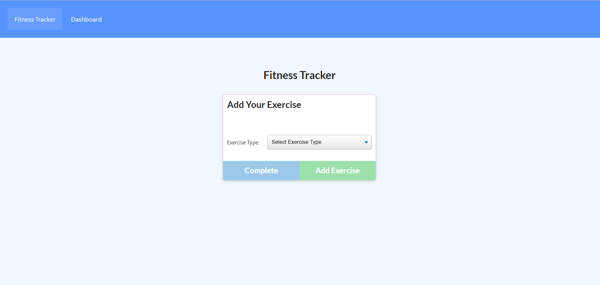
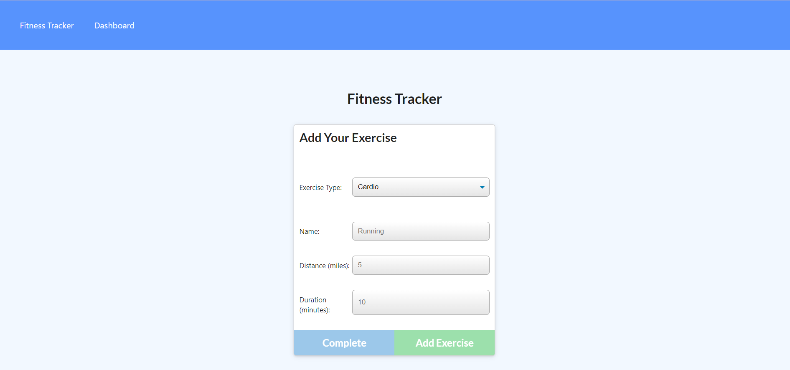
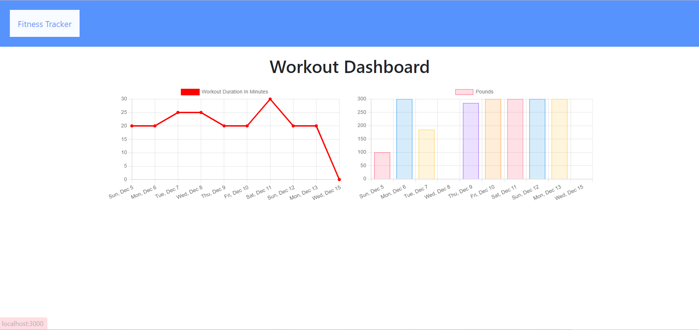
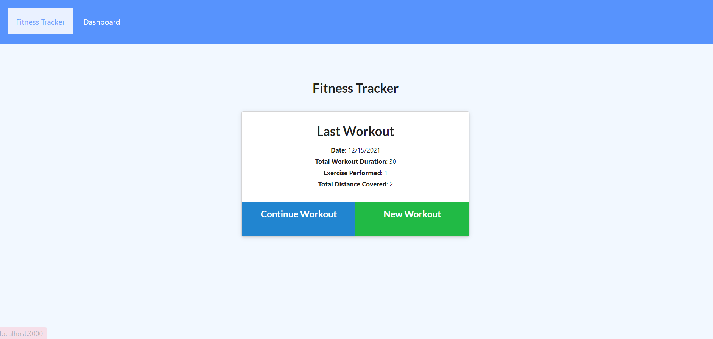

# Workout Tracker

## Description :
This is a workout tracker, where a consumer will reach their fitness goals more quickly when they track their workout progress.

Where you can view create and track daily workouts. Log multiple exercises in a workout on a given day. 

Track the name, type, weight, sets, reps, and duration of exercise. If the exercise is a cardio exercise,you are able to track the distance traveled.

This application uses Mongo database with a Mongoose schema and handle routes with Express.

## Table of contents 

* [Installation](#installation)
* [Usage](#usage)
* [License](#license)
* [Questions](#questions)

## Installation:

- mongobd.

## Usage :

- When the user loads the page, they should be given the option to create a new workout or continue with their last workout. 

- User can add exercises to the most recent workout plan.Or user can add new exercises to a new workout plan. 

-  User can view the combined weight of multiple exercises and the total duration of each workout from the past seven workouts on the `stats` page. 

- User can view the combined weight of multiple exercises from the past seven workouts on the page. 

## license:

]

## Questions:

- Please feel free to email at : m23saini@gmail.com

- [GITHUB](https://github.com/mandy2324).
- [LinkedIn](https://www.linkedin.com/in/m23saini)

